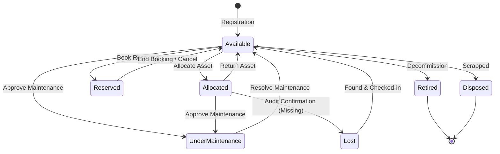
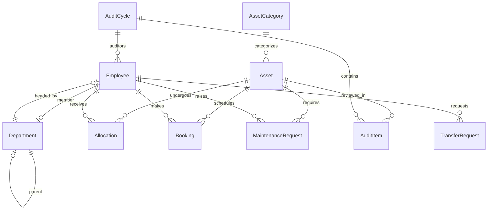

# AssetFlow — Comprehensive Project Analysis & Engineering Blueprint

This document serves as the architectural review and requirement verification for **AssetFlow** (Enterprise Asset & Resource Management Platform). It integrates findings from the [AssetFlow problem statement.pdf](file:///c:/snehan/competitions/2026-07_Odoo/AssetFlow/AssetFlow%20problem%20statement.pdf), [docs/00-project-plan.md](file:///c:/snehan/competitions/2026-07_Odoo/AssetFlow/docs/00-project-plan.md), and [AGENTS.md](file:///c:/snehan/competitions/2026-07_Odoo/AssetFlow/AGENTS.md) to establish a rigorous, implementation-ready baseline.

---

## 1. Executive Summary

AssetFlow is a multi-role Enterprise Resource Planning (ERP) subsystem designed to digitize physical asset lifecycles, govern shared resource bookings, automate maintenance approvals, and coordinate compliance audits. 

The codebase currently contains basic React 19 (Vite) and Express.js boilerplates with empty directories and no shared logic or schemas. To build a winning, production-quality solution, we must structure the system using a **feature-first architecture** with strict database constraints, robust Role-Based Access Control (RBAC), and automated validation. 

### Key Assessment Points:
- **Scope Viability**: Completing the 10 core screens with the requested enterprise polish is feasible but requires a clean division of labor.
- **Architectural Gaps**: The documentation does not specify how category-specific fields (e.g., warranty periods) are modeled or how concurrent booking overlaps are resolved at the database level.
- **Critical Risk**: Without a containerized database, local developer environments will drift. We will address this by generating a standardized `docker-compose.yml` for local PostgreSQL setup.

---

## 2. Official Requirement Traceability Matrix

This matrix maps functional requirements from the official PDF to their corresponding folder modules, UI screens, API endpoints, database entities, and associated business rules.

| # | Requirement / Screen | Module / Folder | UI Route / Component | Target APIs | DB Entities | Core Business Rules |
|---|----------------------|-----------------|----------------------|-------------|-------------|---------------------|
| 1 | **Login / Signup** | `features/auth` | `/login`, `/signup` | `POST /api/auth/signup`<br>`POST /api/auth/login`<br>`POST /api/auth/refresh`<br>`POST /api/auth/logout`<br>`GET /api/auth/me` | `Employee` | - Signup defaults to Employee role.<br>- Admin promotes roles manually.<br>- Email & password authentication.<br>- Secure JWT refresh-token rotation. |
| 2 | **Dashboard** | `features/dashboard` | `/dashboard` | `GET /api/dashboard/kpis` | Aggregated view of `Asset`, `Booking`, `Allocation`, `MaintenanceRequest` | - Role-based KPI visibility.<br>- Highlight overdue returns separately.<br>- Quick actions for authorized users. |
| 3 | **Organization Setup** | `features/admin` | `/admin/org-setup` | `GET /api/admin/employees`<br>`PATCH /api/admin/employees/:id/role`<br>`POST/PUT/PATCH /api/admin/departments`<br>`POST/PUT/PATCH /api/admin/categories` | `Employee`, `Department`, `AssetCategory` | - Admin-only access.<br>- Department tree supports parent departments.<br>- Role promotion restricted to this page. |
| 4 | **Asset Registration** | `features/assets` | `/assets`, `/assets/new`, `/assets/:id` | `POST /api/assets`<br>`GET /api/assets`<br>`GET /api/assets/:id`<br>`PUT /api/assets/:id`<br>`GET /api/assets/:id/history` | `Asset`, `AssetCategory`, `Allocation`, `MaintenanceRequest` | - Auto-generate unique asset tags (AF-XXXX).<br>- Category-specific metadata (JSONB).<br>- `shared/bookable` flag sets eligibility for resource booking. |
| 5 | **Asset Allocation** | `features/allocation` | `/allocations` | `POST /api/allocations`<br>`POST /api/allocations/transfer` | `Allocation`, `TransferRequest` | - Block double-allocations.<br>- Suggest transfer request when asset is occupied.<br>- Mandatory check-in condition notes upon return. |
| 6 | **Resource Booking** | `features/booking` | `/bookings` | `GET /api/bookings`<br>`POST /api/bookings`<br>`PATCH /api/bookings/:id`<br>`DELETE /api/bookings/:id` | `Booking`, `Asset` | - Conflict validation: block overlapping time-slots.<br>- Resource must be flagged as `shared/bookable`. |
| 7 | **Maintenance** | `features/maintenance` | `/maintenance` | `POST /api/maintenance`<br>`GET /api/maintenance`<br>`PATCH /api/maintenance/:id/status`<br>`PATCH /api/maintenance/:id/assign` | `MaintenanceRequest` | - Employee raises request; Asset Manager approves.<br>- On approval, asset status transitions to `UNDER_MAINTENANCE`.<br>- On resolution, asset status reverts to `AVAILABLE`. |
| 8 | **Asset Audit** | `features/audit` | `/audits`, `/audits/:id` | `POST /api/audits`<br>`GET /api/audits/:id`<br>`POST /api/audits/:id/items`<br>`POST /api/audits/:id/close` | `AuditCycle`, `AuditItem` | - Admin creates audit cycle.<br>- Auditor evaluates assets as Verified, Missing, or Damaged.<br>- Closing the cycle locks records and marks missing assets as `LOST`. |
| 9 | **Reports & Analytics** | `features/reports` | `/reports` | `GET /api/reports/utilization`<br>`GET /api/reports/maintenance`<br>`GET /api/reports/bookings`<br>`GET /api/reports/export` | Queries all core tables | - Exportable reporting data.<br>- Resource booking heatmaps.<br>- Asset utilization trends. |
| 10| **Logs & Notifications** | `features/notifications` | `/notifications`, `/admin/logs` | `GET /api/notifications`<br>`PATCH /api/notifications/:id/read`<br>`GET /api/admin/audit-logs` | `Notification`, `AuditLog` | - Log all mutations (who did what, when).<br>- Trigger notifications on status changes and overdue assets. |

---

## 3. Completeness Analysis

An analysis of the official requirements highlights several missing specifications required for enterprise software design:

- **Dynamic Asset Category Fields**: The requirement describes optional category-specific fields (e.g., warranty period for Electronics). The documentation does not explain how these custom fields are structured or modified.
  - *Recommendation*: Use PostgreSQL `JSONB` for category-specific fields on the `Asset` table, with schema validation defined dynamically using JSON schema validation or runtime metadata parsing.
- **Transfer Request Hierarchy**: When a transfer request is made, who is authorized to approve it?
  - *Recommendation*: Let the Department Head of the department holding the asset *or* the Asset Manager approve the transfer.
- **Auditor Promotion & Assignation**: The PDF states that the Admin creates Audit Cycles and assigns "one or more auditors." Who can be an auditor?
  - *Recommendation*: Any `Employee` can be assigned as an auditor for a specific audit cycle, but they only gain access to the specific audit screen for their assigned cycle.
- **Overdue Returns Identification**: How are overdue allocations calculated and flagged?
  - *Recommendation*: Introduce a scheduled daily script (or background worker check) that matches `expectedReturnDate` with current time and updates an `isOverdue` flag on the `Allocation` table, alongside triggering real-time alerts on the Dashboard.

---

## 4. Business Rule Validation & State Transitions

### Asset Lifecycle State Machine
Assets transition between states according to precise workflows. The state transition rules are mapped below:



### State Transition Validation Rules:
1. **Double Allocation Blocking**:
   - *Constraint*: An asset cannot have two active allocations.
   - *Implementation*: Enforce at the database level using a partial index on the `Allocation` table where `returnedAt IS NULL` and `assetId` is unique.
2. **Resource Booking Overlap Rules**:
   - *Constraint*: Bookings for the same asset cannot overlap.
   - *Logic*: Let $S_1$ and $E_1$ be the start and end of the existing booking, and $S_2$ and $E_2$ be the new booking times. Block if:
     $$S_2 < E_1 \quad \text{and} \quad E_2 > S_1$$
   - *Implementation*: Enforce via database transaction locks (`SELECT FOR UPDATE`) and an application-level overlap verification block.
3. **Deactivation Rules**:
   - *Constraint*: Cannot deactivate a department if it contains active, allocated assets or active employees.
   - *Constraint*: Cannot deactivate an employee who currently holds allocated assets.

---

## 5. Domain Analysis

### Core Entities & Relationships



### Domain Events:
- `AssetRegistered`: Fired when a new asset is added.
- `AssetAllocated`: Fired on successful allocation.
- `TransferRequested`: Triggers notification to the current holder's manager.
- `BookingOverlapped`: System event for rejected bookings.
- `MaintenanceApproved`: Changes asset status to `UNDER_MAINTENANCE` and notifies technician.
- `AuditCycleClosed`: Recalculates asset statuses and outputs the discrepancy report.

---

## 6. Architecture Review

We validate the proposed architectural layers for both efficiency and developer speed:

- **Feature-First Organization**: Grouping by feature folder (e.g., `features/assets`) prevents directory hopping. It is superior to organizing by technical layer alone.
- **Repository Pattern vs. Direct Prisma Client**:
  - *Tradeoff*: While a repository layer isolates database logic, direct Prisma usage is extremely fast and type-safe for a hackathon setup.
  - *Decision*: We will use a **Service-Repository** pattern where business logic resides in Services, and DB interactions are kept in clean Repository modules. This maintains modularity without adding boilerplate.
- **Storage Abstraction**:
  - We will define a `StorageService` interface containing `uploadFile(file)` and `deleteFile(fileId)`.
  - In development, it resolves to a `LocalFileSystemStorageService` saving to `uploads/`.
  - In production, it resolves to a `CloudinaryStorageService`.

---

## 7. UI/UX Review

The UI must reflect a premium enterprise product (like Linear or Stripe) rather than a basic dashboard template:

- **Consistent Color System**: Avoid pure black or pure primary colors. Use deep grays, subtle slate/zinc variables, and cohesive primary colors (e.g., HSL `220 14.3% 11.5%` for dark backgrounds).
- **Sticky Actions**: In forms or list pages, action headers must stick to the top on scroll to prevent the user from losing context.
- **Accessibility**: Keyboard navigation (`Tab`, `Enter`, `Escape` for dialogs) and screen-reader friendly ARIA attributes on buttons/dialogs are mandatory.
- **Transitions**: Smooth micro-animations for status chips (e.g., transitioning color when status changes) and loading skeletons on dashboards are required.

---

## 8. Security Review

- **JWT Authentication Strategy**:
  - Short-lived Access Token (15m) passed in memory or request headers.
  - Long-lived Refresh Token (7d) stored in an `httpOnly`, `secure`, `sameSite=strict` cookie.
- **RBAC Enforcement**:
  - Express middleware: `authorizeRoles('ADMIN', 'ASSET_MANAGER', 'DEPT_HEAD')` checking the user's role on the request object.
  - Frontend route wrapping: protect components based on user context.
- **Role Assignment**:
  - Standard employees sign up as `EMPLOYEE`. The `ADMIN` promotes them in the Employee Directory. Promotion from other pages must be rejected.
- **Input Sanitization**:
  - Use Zod schemas to sanitize and parse input payloads before they hit controllers.

---

## 9. Performance Review

- **Database Indexes**:
  - Index `Asset(assetTag)` for fast lookups.
  - Index `Allocation(assetId, employeeId, returnedAt)` for tracking history.
  - Index `Booking(assetId, startTime, endTime)` for overlap validation queries.
- **Pagination**:
  - Direct database-level pagination (offset/limit or cursor-based) for the Asset Directory and Activity Logs.
- **Caching**:
  - Cache static configurations (e.g., category listings, department structures) in-memory or on the client side using TanStack Query.

---

## 10. Merge Conflict & Development Split Strategy

To prevent merge conflicts during the hackathon, we divide folder and API ownership cleanly between two developers:

```
                               ┌─────────────────────────┐
                               │     Shared Infrastructure│
                               │  - Prisma Client & Schema│
                               │  - Storage Wrapper & Auth│
                               └────────────┬────────────┘
                                            │
                     ┌──────────────────────┴──────────────────────┐
                     ▼                                             ▼
       ┌───────────────────────────┐                 ┌───────────────────────────┐
       │       Developer 1         │                 │       Developer 2         │
       ├───────────────────────────┤                 ├───────────────────────────┤
       │ - features/auth           │                 │ - features/booking        │
       │ - features/admin          │                 │ - features/maintenance    │
       │ - features/assets         │                 │ - features/audit          │
       │ - features/allocation     │                 │ - features/reports        │
       │ - DB schema (core tables) │                 │ - features/notifications  │
       └───────────────────────────┘                 └───────────────────────────┘
```

- **Conflict Mitigation Rule**: Developers must only modify files inside their assigned feature directories. Shared configuration changes (like Prisma schemas or Tailwind configs) must be coordinated.

---

## 11. Hackathon Feasibility & Timeline Analysis

### Critical Path (8-Hour Limit):
```mermaid
gantt
    title Hackathon Development Timeline (8 Hours)
    dateFormat  H
    axisFormat %H:00
    section Setup & Core
    Database & Docker Setup :active, d1, 0, 1h
    Authentication & RBAC   : d2, 1h, 1h
    section Feature Group 1
    Asset Registry          : d3, 2h, 1.5h
    Allocation & Transfers  : d4, 3.5h, 1.5h
    section Feature Group 2
    Resource Bookings       : d5, 5h, 1.5h
    Maintenance & Audits    : d6, 6.5h, 1h
    section Polish
    Reports & Analytics     : d7, 7.5h, 0.5h
```

- **Recommendation**: Complete database schema definition, Auth, and the Asset Registry by Hour 3. If running behind schedule, prioritize standard Allocations over complex Transfer requests.

---

## 12. AI Readiness

Our project structure and design patterns are highly optimized for AI-assisted code generation:
- **Zero Ambiguity**: Using strict types, explicit Prisma model names, and standardized routes allows AI agents to write logic for individual features without modifying neighboring modules.
- **Zod Schemas**: Serving as validators, Zod schemas double as complete type-definitions that can be shared between the frontend and backend.

---

## 13. Final Recommendations

Here are the prioritized adjustments needed to make AssetFlow fully production-ready:

### 1. Database-Level Double-Allocation Constraint
- **Priority**: `CRITICAL`
- **Reason**: Application-level checks are prone to race conditions under load.
- **Solution**: Implement a unique partial index on `Allocation` for `assetId` where `returnedAt` is NULL.
- **Effort**: Low (Prisma schema migration).

### 2. Time-Slot Overlap Partial Constraint
- **Priority**: `HIGH`
- **Reason**: Standard relational databases do not prevent overlapping intervals out-of-the-box without custom queries.
- **Solution**: Execute a transaction-wrapped query checking for overlapping intervals before inserting a new `Booking`.
- **Effort**: Medium.

### 3. Dynamic Category Attributes using JSONB
- **Priority**: `HIGH`
- **Reason**: Static relational columns for custom category fields will result in a bloated schema.
- **Solution**: Implement a `metadata` column of type `Json` on the `Asset` table, coupled with category-defined schema shapes.
- **Effort**: Medium.

### 4. Overdue Check Background Engine
- **Priority**: `MEDIUM`
- **Reason**: The dashboard needs to display overdue items immediately without loading heavy historical tables.
- **Solution**: Add a background status-checking job (or middleware-triggered event) that flags assets past their expected return date.
- **Effort**: Low.
