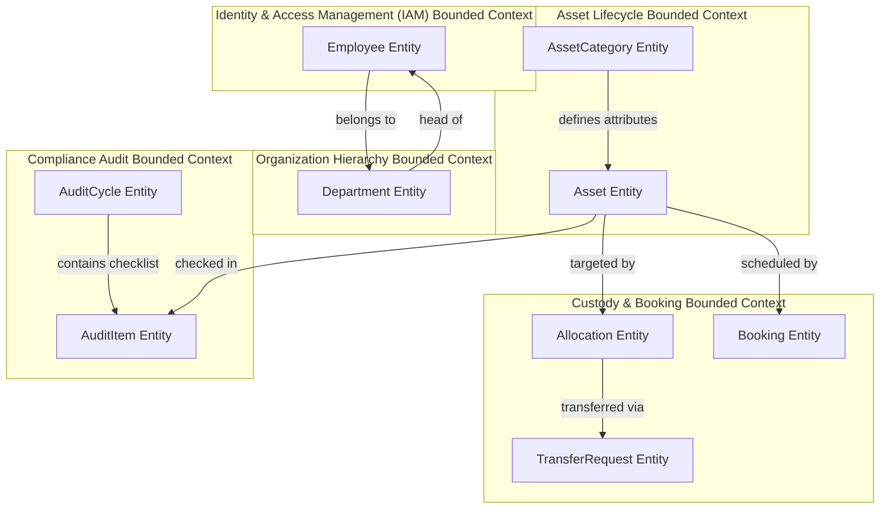
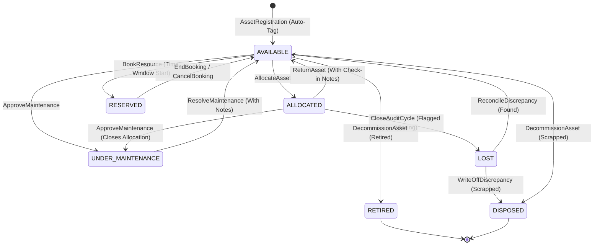
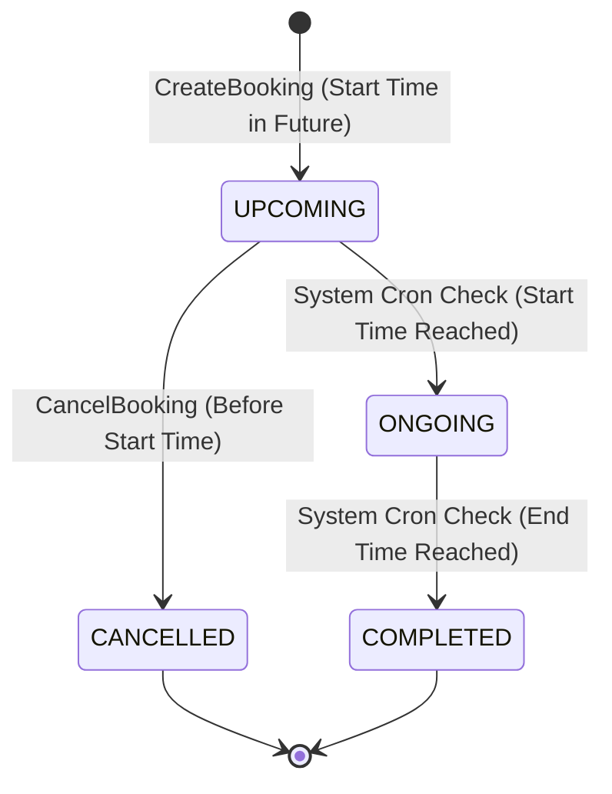
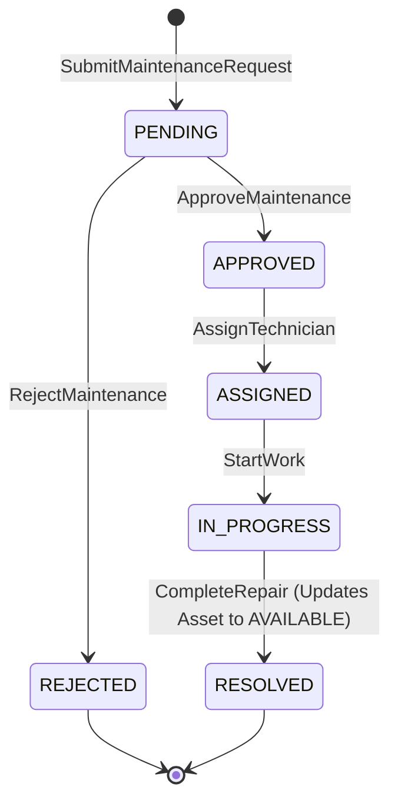
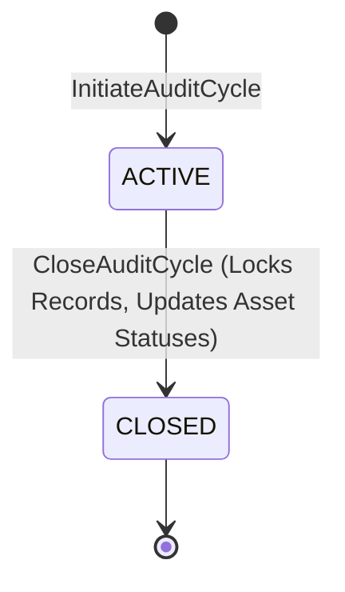

# AssetFlow — Domain Model Specification

This document defines the functional and semantic architecture of the **AssetFlow** business domain. It models the core business capabilities, bounded contexts, entities, value objects, lifecycles, and domain events that form the "ERP Brain" of the system. 

It focuses on business relationships, invariants, and structural rules, and explicitly avoids database-specific schemas or implementation details.

---

## 1. Executive Summary

AssetFlow is an enterprise-grade Asset & Resource Management ERP subsystem designed to solve the challenges of modern asset lifecycle tracking, department allocations, concurrent booking of shared resources, maintenance tracking, and audit compliance.

This domain model serves as the blueprint for developer alignment. It ensures that the system's software components map 1:1 to real-world business entities and operations. It enforces clear boundaries between feature sets while maintaining high consistency across organizational hierarchies, allocations, and compliance lifecycles.

---

## 2. Domain Overview & Ubiquitous Language

To ensure communication consistency between software developers, designers, and domain experts, the following terms form the ubiquitous language of AssetFlow:

*   **Employee**: An active worker within the organization. Employees are assigned a security role (`ADMIN`, `ASSET_MANAGER`, `DEPT_HEAD`, `EMPLOYEE`) that determines their permissions.
*   **Department**: A logical unit of the organization. Departments can be nested to form a hierarchy (e.g., "Engineering" under "Operations").
*   **Asset**: A physical item owned by the organization. It is categorized and tracked through its status lifecycle.
*   **Asset Tag**: A unique system-generated alphanumeric tag (`AF-XXXX`) assigned to each asset upon registration.
*   **Asset Category**: A template grouping similar assets (e.g., "Laptops", "Vehicles") that defines a JSON schema for category-specific custom attributes (e.g., "RAM" for laptops, "Fuel Type" for vehicles).
*   **Allocation**: The operational act of assigning custody of an asset to an individual employee or an entire department.
*   **Transfer Request**: A request raised by an employee or department head to take custody of an asset currently allocated to another holder.
*   **Booking**: A reservation of a shared, bookable asset (e.g., meeting room, company vehicle) for a specific time window.
*   **Maintenance Request**: A repair or service request raised for an asset, requiring manager approval, technician assignment, and resolution tracking.
*   **Audit Cycle**: A time-bound compliance audit initiated by an Admin to verify the location, existence, and physical condition of assets within a defined organizational scope.
*   **Audit Item**: A specific checklist item in an active audit cycle mapping to a scoped asset, reviewed by an auditor.
*   **Discrepancy**: A condition where an audited asset is marked as `MISSING` or `DAMAGED`, triggering mandatory review and resolution protocols.

---

## 3. Core Business Capabilities

AssetFlow provides five core business capabilities:

```
┌─────────────────────────────────────────────────────────────────────────────────┐
│                                   AssetFlow ERP                                 │
└───────┬─────────────────┬───────────────────┬───────────────────┬───────────────┘
        │                 │                   │                   │
        ▼                 ▼                   ▼                   ▼
┌──────────────┐   ┌──────────────┐   ┌──────────────┐   ┌─────────────────┐
│ Organization │   │  Asset Life  │   │ Custody &    │   │  Audit &        │
│ & Access     │   │  Lifecycle   │   │ Reservations │   │  Compliance     │
├──────────────┤   ├──────────────┤   ├──────────────┤   ├─────────────────┤
│ - IAM & RBAC │   │ - Registry   │   │ - Allocation │   │ - Audit Cycles  │
│ - Dept Tree  │   │ - Cust Fields│   │ - Transfers  │   │ - Discrepancy   │
│ - Directory  │   │ - Decomm     │   │ - Calendar   │   │ - History Logs  │
└──────────────┘   └──────────────┘   └──────────────┘   └─────────────────┘
```

1.  **Organization & Access Governance**: Establishes identity boundaries, hierarchical structures, and strict role-based access rules.
2.  **Asset Lifecycle Registry**: Registers, tracks, and decommission assets, while capturing custom, category-specific metadata.
3.  **Custody & Reservations Engine**: Governs double-allocation checks, department-to-department transfers, and conflict-free booking of shared assets.
4.  **Maintenance & Recovery Management**: Handles employee-initiated repair tickets, technician scheduling, and status synchronizations.
5.  **Audit & Compliance System**: Organizes scoped physical audits, assigns auditors, records discrepancies, and forces resolution workflows.

---

## 4. Bounded Contexts

The AssetFlow domain is divided into five Bounded Contexts, each defining its own model boundaries and ubiquitous language:



### 1. Identity & Access Management (IAM) Context
*   **Focus**: User identity, password verification, active sessions, and Role-Based Access Control (RBAC).
*   **Key Actors**: Guest, Employee, Admin.
*   **Invariants**: Every employee has a unique email. A signup default role of `EMPLOYEE` is forced.

### 2. Organization Structure Context
*   **Focus**: Department hierarchy, cycle prevention in nested structures, and department deactivation safeguards.
*   **Key Actors**: Admin.
*   **Invariants**: A department cannot be its own parent. A department cannot be deactivated if it contains active employees or active asset allocations.

### 3. Asset Lifecycle Context
*   **Focus**: Serial registration, custom category-specific attributes (JSON schema structure), and decommissioning of obsolete inventory.
*   **Key Actors**: Asset Manager, Admin.
*   **Invariants**: System-generated asset tags must match `AF-XXXX`. Decommissioning is permitted only if the asset is in an `AVAILABLE` state.

### 4. Custody & Booking Context
*   **Focus**: Preventing simultaneous double-allocations, managing approval authorities for transfers, and guaranteeing zero-overlap schedule slots.
*   **Key Actors**: Employee, Department Head, Asset Manager.
*   **Invariants**: Assets cannot have more than one active allocation. Resource bookings must not overlap. Bookings can only be created for assets with the `isBookable` flag set to true.

### 5. Compliance Audit Context
*   **Focus**: Audit scoping, progress monitoring, discrepancy flagging (missing/damaged), and cycle closure updates (Missing $\rightarrow$ Lost).
*   **Key Actors**: Admin, Auditor (Assigned Employee), Asset Manager.
*   **Invariants**: Scoped assets are locked in audit mode (no deletes or edits). Closing an audit cycle locks all audit item records.

---

## 5. Domain Entities & Responsibilities

The responsibilities and attributes of each core domain entity are defined below:

### Employee
*   **Context**: IAM / Auth
*   **Responsibilities**:
    *   Represents an authenticated staff member.
    *   Holds credentials and active authorization roles.
    *   Acts as the custodian for allocated assets or owner of booking reservations.
    *   Maintains status (`ACTIVE`, `INACTIVE`) to prevent deactivated users from logging in or retaining assets.

### Department
*   **Context**: Organization Structure
*   **Responsibilities**:
    *   Represents a functional unit of the company.
    *   Maintains a hierarchical parent-child relation.
    *   Hosts allocations directly assigned to the department rather than an individual.
    *   Maintains a Department Head who acts as the primary transfer authority for assets within that department.

### AssetCategory
*   **Context**: Asset Lifecycle
*   **Responsibilities**:
    *   Groups related assets.
    *   Defines the `customFieldsSchema` (a JSON schema specification) outlining what custom fields are required for assets registered under it (e.g., Laptop $\rightarrow$ RAM, Storage, OS).

### Asset
*   **Context**: Asset Lifecycle
*   **Responsibilities**:
    *   Represents a physical asset tagged with a unique `AF-XXXX` tag.
    *   Maintains its primary state (`AVAILABLE`, `ALLOCATED`, `RESERVED`, `UNDER_MAINTENANCE`, `LOST`, `RETIRED`, `DISPOSED`).
    *   Holds the dynamic category-specific metadata matching the category's schema.
    *   Exposes flags like `isBookable` to declare eligibility for shared resource booking.

### Allocation
*   **Context**: Custody & Booking
*   **Responsibilities**:
    *   Represents active or historical custody of an asset.
    *   Must link to **either** a receiving Employee or a receiving Department.
    *   Tracks allocation timeframe (`allocatedAt` and `expectedReturnDate`).
    *   Closes custody by recording return details (`returnedAt`, check-in condition rating, and notes).

### TransferRequest
*   **Context**: Custody & Booking
*   **Responsibilities**:
    *   Manages the transition of custody from one employee/department to another.
    *   Maintains a status workflow (`PENDING`, `APPROVED`, `REJECTED`).
    *   Logs transfer reasoning and maps the approval authority to the department head of the current holder.

### Booking
*   **Context**: Custody & Booking
*   **Responsibilities**:
    *   Schedules temporary usage slots for shared assets.
    *   Enforces strict non-overlapping time windows.
    *   Maintains booking status (`UPCOMING`, `ONGOING`, `COMPLETED`, `CANCELLED`).
    *   Links to the individual employee making the booking, or department-level bookings made by Department Heads.

### MaintenanceRequest
*   **Context**: Custody & Booking
*   **Responsibilities**:
    *   Tracks repair issues reported by employees.
    *   Follows status pipeline (`PENDING`, `APPROVED`, `REJECTED`, `ASSIGNED`, `IN_PROGRESS`, `RESOLVED`).
    *   Synchronizes with the asset's state: transitions the asset to `UNDER_MAINTENANCE` upon approval, and restores it to `AVAILABLE` upon resolution.

### AuditCycle
*   **Context**: Compliance Audit
*   **Responsibilities**:
    *   Defines a physical asset verification audit campaign.
    *   Saves the scope parameters (by department or category) and maps the assigned employee auditors.
    *   Transitions from `ACTIVE` to `CLOSED`.

### AuditItem
*   **Context**: Compliance Audit
*   **Responsibilities**:
    *   Represents the physical audit check for a specific asset within an audit cycle.
    *   Saves the evaluation status (`VERIFIED`, `MISSING`, `DAMAGED`) and auditor notes.
    *   Records resolution parameters once an Asset Manager resolves any discrepancies.

---

## 6. Aggregate Roots & Boundaries

To guarantee transaction safety, consistency boundary rules are established around these Aggregate Roots:

```
┌──────────────────────────────────────────────────────────────────────────────┐
│  Asset Aggregate Root                                                        │
│                                                                              │
│  ┌─────────────────┐             ┌─────────────────┐                         │
│  │   Asset Category│             │      Asset      │                         │
│  │   (Schema Rules)├────────────►│ (LifecycleState)│                         │
│  └─────────────────┘             └─────────┬───────┘                         │
│                                            │                                 │
│                                            ▼                                 │
│                                   ┌─────────────────┐                        │
│                                   │   Maintenance   │                        │
│                                   │     Tickets     │                        │
│                                   └─────────────────┘                        │
└──────────────────────────────────────────────────────────────────────────────┘

┌──────────────────────────────────────────────────────────────────────────────┐
│  Allocation Aggregate Root                                                   │
│                                                                              │
│  ┌─────────────────┐             ┌─────────────────┐                         │
│  │   Allocation    │◄────────────┤ TransferRequest │                         │
│  │ (Custody Record)│             │ (Status Workflow│                         │
│  └─────────────────┘             └─────────────────┘                         │
└──────────────────────────────────────────────────────────────────────────────┘

┌──────────────────────────────────────────────────────────────────────────────┐
│  AuditCycle Aggregate Root                                                   │
│                                                                              │
│  ┌─────────────────┐             ┌─────────────────┐                         │
│  │   AuditCycle    │────────────►│   AuditItem     │                         │
│  │ (Active Scope)  │             │ (Checklist Row) │                         │
│  └─────────────────┘             └─────────────────┘                         │
└──────────────────────────────────────────────────────────────────────────────┘
```

1.  **Asset Aggregate Root**: The `Asset` is the root. It contains nested `MaintenanceRequests`. Changes to maintenance status, category metadata compliance, or decommissioning rules must pass validation checks defined in the `Asset` entity.
2.  **Allocation & Transfer Aggregate Root**: The `Allocation` is the root. It governs the child entity `TransferRequest`. A transfer request cannot exist without a parent active allocation, and its approval directly updates the status of the parent allocation.
3.  **Booking Aggregate Root**: The `Booking` is an independent aggregate root. It maintains internal consistency (times, ownership) and references the `Asset` aggregate root to run concurrent overlap checks.
4.  **AuditCycle Aggregate Root**: The `AuditCycle` is the root. It owns multiple `AuditItem` records. When the `AuditCycle` is closed, the root triggers state changes on its child items, locking them from modifications and propagating status changes to the referenced assets.
5.  **Employee Aggregate Root**: The `Employee` is the root. It maintains references to the departments they belong to or manage.

---

## 7. Value Objects

The domain relies on the following Value Objects to enforce attributes' business invariants:

*   **AssetTag**: Encapsulates tag validation rules. Validates that the string has the format `AF-XXXX` where `XXXX` is a sequential integer.
*   **PasswordHash**: Encapsulates password strength rules (length $\ge 8$, containing at least one number and one special character) and password hashing operations.
*   **TimeInterval**: Enforces booking duration constraints. Ensures the start time is in the future, the end time is greater than the start time, and the duration is at least 15 minutes.
*   **CustomFieldsSchema**: Enforces validity constraints on category-specific attribute structures (contains fields with keys `name`, `type`, and `required`).
*   **ConditionRating**: Restricts check-in condition values to: `EXCELLENT`, `GOOD`, `FAIR`, `DAMAGED`.

---

## 8. Domain Events

Domain events represent significant state transitions in the system. They decouple contexts by triggering asynchronous actions like notifications, logs, and token invalidations:

| Event Name | Originating Context | Business Trigger | Key Payload | Downstream Side-Effects / Consumers |
|---|---|---|---|---|
| `EmployeeRegistered` | IAM | Successful visitor signup | `employeeId`, `email`, `role` | Writes a registration entry to the System Audit Log. |
| `EmployeeRoleUpdated` | IAM | Admin changes employee role | `employeeId`, `oldRole`, `newRole` | Purges targets active refresh tokens; triggers immediate session invalidation; sends updated role notification. |
| `AssetRegistered` | Asset Lifecycle | Manager adds new asset | `assetId`, `assetTag`, `category` | Auto-generates unique `AF-XXXX` tag; validates category schema parameters. |
| `AssetDecommissioned`| Asset Lifecycle | Manager retires/scraps asset | `assetId`, `assetTag`, `reason` | Deletes all upcoming booking schedules for that asset; updates status to `RETIRED` or `DISPOSED`. |
| `AssetAllocated` | Custody / Booking | Manager assigns asset custody | `allocationId`, `assetId`, `holderId` | Sets asset status to `ALLOCATED`; pushes an custody alert to the receiving employee. |
| `TransferRequested` | Custody / Booking | User requests active asset | `requestId`, `assetId`, `holderId` | Registers pending request; notifies both current holder and holding department head. |
| `TransferApproved` | Custody / Booking | Authorized role approves transfer | `requestId`, `oldAllocationId`, `newAllocationId` | Closes old allocation; opens new allocation; transitions asset status; notifies new and old holders. |
| `BookingCreated` | Custody / Booking | User books shared asset | `bookingId`, `assetId`, `startTime` | Sets asset status to `RESERVED` during the active booking slot; queues a reminder notification for 15 minutes before the start time. |
| `MaintenanceApproved`| Custody / Booking | Manager approves repair request | `requestId`, `assetId`, `priority` | Transitions asset status to `UNDER_MAINTENANCE`; cancels any booking schedules overlapping the maintenance window. |
| `MaintenanceResolved`| Custody / Booking | Repair is flagged as complete | `requestId`, `assetId`, `notes` | Reverts asset status to `AVAILABLE`; updates condition rating. |
| `AuditCycleInitiated`| Compliance Audit | Admin creates audit campaign | `cycleId`, `scope`, `auditors` | Pre-populates `AuditItem` checklists; sends assignments to designated auditors; sets asset lockouts. |
| `AuditItemFlagged` | Compliance Audit | Auditor marks asset as missing/damaged | `itemId`, `assetId`, `status` | Marks item as discrepancy; triggers real-time warning on Asset Managers dashboard. |
| `AuditCycleClosed` | Compliance Audit | Admin closes active campaign | `cycleId`, `lostAssetIds` | Locks all checklist records; transitions missing assets to `LOST` status; generates discrepancy reports. |
| `DiscrepancyResolved`| Compliance Audit | Manager resolves audit flag | `itemId`, `resolutionAction` | Triggers corresponding asset status transitions (`AVAILABLE`, `UNDER_MAINTENANCE`, `DISPOSED`). |

---

## 9. Domain State Machines

The state transition workflows for assets, bookings, maintenance, and audits are modeled below:

### 9.1 Asset Lifecycle State Machine
*   **Rules**:
    *   Direct status modifications are blocked; transitions must occur as side-effects of validated business actions.
    *   Decommissioning to `RETIRED` or `DISPOSED` is restricted to `AVAILABLE` assets.
    *   If an asset is marked as `MISSING` during a closed audit, it transitions to `LOST`.



### 9.2 Shared Resource Booking State Machine
*   **Rules**:
    *   Only assets with `isBookable = true` can enter this state machine.
    *   Cancellations and modifications are blocked once the booking has started.



### 9.3 Maintenance Request State Machine
*   **Rules**:
    *   Any employee can create a request (`PENDING`).
    *   Only Asset Managers or Admins can approve or assign tasks.



### 9.4 Audit Cycle State Machine
*   **Rules**:
    *   Initiated by Admin. Closing the cycle triggers database transactions updating assets flagged as `MISSING` to `LOST`.



---

## 10. Ownership & Data Integrity Rules

To protect the system against data anomalies and security bypasses, the following integrity rules are enforced across the domain model boundaries:

### 10.1 Access & Custody Ownership Rules
1.  **Individual Custody**: An allocation to an Employee maps directly to that employee's user ID.
2.  **Departmental Custody**: An allocation to a Department maps directly to that department's ID. The Department Head acts as the custodian of the asset for approvals and audits.
3.  **Booking Ownership**: Bookings can be owned by an employee or a department. Department Heads can book on behalf of their department; standard employees are restricted to booking on behalf of themselves.

### 10.2 Strict Data Integrity & Dependency Safeguards
1.  **Cycle Prevention (Departments)**: A recursive traversal must prove that the selected parent department ID does not exist as a child or descendant of the department being updated.
2.  **Deactivation Blocks (Departments)**: A department deactivation must be rejected if:
    $$\text{Active Employees Count} > 0 \quad \text{or} \quad \text{Active Allocations Count} > 0$$
3.  **Deactivation Blocks (Employees)**: An employee deactivation must be rejected if they hold active allocations. Deactivating an employee automatically cancels all their future bookings.
4.  **Lockout Mode (Auditing)**: While an asset's department or category is within the scope of an active audit cycle, all update and delete mutations on that asset are blocked.

---

## 11. Future Extensibility Considerations

The domain model is designed to support future SaaS scale-up capabilities without requiring breaking changes:

*   **Multi-Tenancy Support**: The `Employee`, `Department`, and `Asset` structures are designed to inherit a tenant context value object (`TenantId`) in future phases to allow SaaS database partitioning.
*   **Depreciation Logic**: The `Asset` domain model includes price, acquisition date, and category fields to support depreciation calculations (e.g., Straight-line or Double Declining Balance) in future iterations.
*   **External Integration Hooks**: Domain events like `AssetDecommissioned` or `MaintenanceResolved` can be linked to webhooks to push data to external ERP systems like Odoo or SAP.

---

## 12. Domain Model Validation Checklist

To confirm a feature design is complete, it must be validated against the following checklist:

*   [ ] Does the feature map to a defined Bounded Context?
*   [ ] Are all actors and permissions aligned with the IAM Context?
*   [ ] Does every state transition in the design match the state machines?
*   [ ] Have all invariants and double-allocation safeguards been enforced?
*   [ ] Does the feature structure preserve the department tree integrity and prevent cycles?
*   [ ] Are all business events defined with clear payloads and downstream actions?
*   [ ] Are audit lockout rules respected across all asset mutations?
