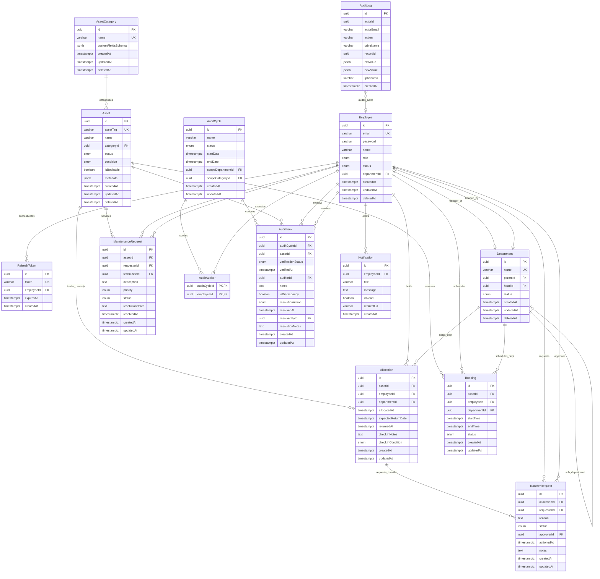

# AssetFlow — Database Design Specification

This document details the relational database schema design for the **AssetFlow** platform. It defines the tables, columns, types, indexes, relational integrity constraints, Soft Delete strategy, audit logging structure, and database migrations plan.

The design utilizes PostgreSQL best practices to guarantee data consistency, enforce business constraints at the database layer (preventing application-level race conditions), and optimize search and query operations.

---

## 1. Database Philosophy

To ensure enterprise-grade reliability and security:

1.  **Strict Database Invariants**: Business rules must be backed by database constraints (e.g., check constraints, unique constraints, foreign keys). We do not rely solely on application-layer logic.
2.  **Explicit Normalization**: The database is structured in Third Normal Form (3NF) to eliminate duplication and prevent write anomalies. 
3.  **JSONB for Dynamic Fields Only**: JSONB is restricted strictly to two fields: `AssetCategory.customFieldsSchema` (stores the dynamic attributes schema definition) and `Asset.metadata` (stores the actual values matching the schema), and `AuditLog` fields for payload diffs. Standard columns are used for all structured ERP entities.
4.  **Enforced Soft Deletes**: Deletion of critical configuration entities (`Employee`, `Department`, `AssetCategory`, `Asset`) uses a Soft Delete pattern (marking `deletedAt`) to preserve relational history across historic allocation and audit records.
5.  **Audit-Ready History**: In addition to transactional logs, a dedicated, write-once `AuditLog` table records every database mutation (insert, update, delete) to maintain compliance and tracing.

---

## 2. Mermaid Entity Relationship (ER) Diagram

The physical schema relationships and multiplicity are modeled below:



---

## 3. Database Schema Tables & Dictionary

The PostgreSQL physical schema details are categorized below:

### 3.1 ENUMS
To enforce static domain state whitelists, the following custom type enums are created in PostgreSQL:
*   `UserRole`: `'ADMIN'`, `'ASSET_MANAGER'`, `'DEPT_HEAD'`, `'EMPLOYEE'`
*   `UserStatus`: `'ACTIVE'`, `'INACTIVE'`
*   `AssetStatus`: `'AVAILABLE'`, `'ALLOCATED'`, `'RESERVED'`, `'UNDER_MAINTENANCE'`, `'LOST'`, `'RETIRED'`, `'DISPOSED'`
*   `AssetCondition`: `'EXCELLENT'`, `'GOOD'`, `'FAIR'`, `'DAMAGED'`
*   `TransferStatus`: `'PENDING'`, `'APPROVED'`, `'REJECTED'`
*   `BookingStatus`: `'UPCOMING'`, `'ONGOING'`, `'COMPLETED'`, `'CANCELLED'`
*   `MaintenancePriority`: `'LOW'`, `'MEDIUM'`, `'HIGH'`, `'CRITICAL'`
*   `MaintenanceStatus`: `'PENDING'`, `'APPROVED'`, `'REJECTED'`, `'ASSIGNED'`, `'IN_PROGRESS'`, `'RESOLVED'`
*   `AuditStatus`: `'ACTIVE'`, `'CLOSED'`
*   `AuditVerificationStatus`: `'VERIFIED'`, `'MISSING'`, `'DAMAGED'`
*   `DiscrepancyResolution`: `'CREATE_MAINTENANCE'`, `'WRITE_OFF'`, `'RECONCILED'`

---

### 3.2 Tables Definition

#### Table: `Employee`
Represents users and staff members with access privileges.

| Column | Data Type | Nullable | Default | Constraints / Index | Description |
|---|---|---|---|---|---|
| `id` | UUID | No | `gen_random_uuid()` | PK | Unique identifier for the employee. |
| `email` | VARCHAR(255) | No | None | Unique, Index | Email address used for authentication. |
| `password` | VARCHAR(255) | No | None | None | Bcrypt hashed password. |
| `name` | VARCHAR(100) | No | None | None | Full name of the employee. |
| `role` | `UserRole` | No | `'EMPLOYEE'` | Index | Security clearance role. |
| `status` | `UserStatus` | No | `'ACTIVE'` | Index | Account status. |
| `departmentId` | UUID | Yes | NULL | FK, Index | Reference to department (`Department.id`). |
| `createdAt` | TIMESTAMPTZ | No | `NOW()` | None | Timestamp when employee created. |
| `updatedAt` | TIMESTAMPTZ | No | `NOW()` | None | Timestamp when employee updated. |
| `deletedAt` | TIMESTAMPTZ | Yes | NULL | Index | Soft Delete timestamp. |

---

#### Table: `RefreshToken`
Manages user authentication refresh tokens for session persistence.

| Column | Data Type | Nullable | Default | Constraints / Index | Description |
|---|---|---|---|---|---|
| `id` | UUID | No | `gen_random_uuid()` | PK | Unique identifier. |
| `token` | VARCHAR(512) | No | None | Unique, Index | Cryptographically secure random string. |
| `employeeId` | UUID | No | None | FK, Index | Reference to employee (`Employee.id`) ON DELETE CASCADE. |
| `expiresAt` | TIMESTAMPTZ | No | None | None | Token expiry timestamp. |
| `createdAt` | TIMESTAMPTZ | No | `NOW()` | None | Token creation timestamp. |

---

#### Table: `Department`
Stores organizational business units.

| Column | Data Type | Nullable | Default | Constraints / Index | Description |
|---|---|---|---|---|---|
| `id` | UUID | No | `gen_random_uuid()` | PK | Unique identifier. |
| `name` | VARCHAR(100) | No | None | Unique, Index | Name of department. |
| `parentId` | UUID | Yes | NULL | FK, Index | Self-referencing FK (`Department.id`) ON DELETE SET NULL. |
| `headId` | UUID | Yes | NULL | FK, Index | Reference to department manager (`Employee.id`) ON DELETE SET NULL. |
| `status` | `UserStatus` | No | `'ACTIVE'` | Index | Status of the department. |
| `createdAt` | TIMESTAMPTZ | No | `NOW()` | None | Timestamp when department created. |
| `updatedAt` | TIMESTAMPTZ | No | `NOW()` | None | Timestamp when department updated. |
| `deletedAt` | TIMESTAMPTZ | Yes | NULL | Index | Soft Delete timestamp. |

---

#### Table: `AssetCategory`
Defines asset groupings and dynamic attributes schema.

| Column | Data Type | Nullable | Default | Constraints / Index | Description |
|---|---|---|---|---|---|
| `id` | UUID | No | `gen_random_uuid()` | PK | Unique identifier. |
| `name` | VARCHAR(100) | No | None | Unique, Index | Name of category. |
| `customFieldsSchema` | JSONB | No | `'[]'::jsonb` | None | JSON schema defining required custom attributes. |
| `createdAt` | TIMESTAMPTZ | No | `NOW()` | None | Timestamp when category created. |
| `updatedAt` | TIMESTAMPTZ | No | `NOW()` | None | Timestamp when category updated. |
| `deletedAt` | TIMESTAMPTZ | Yes | NULL | Index | Soft Delete timestamp. |

---

#### Table: `Asset`
Physical assets inventory.

| Column | Data Type | Nullable | Default | Constraints / Index | Description |
|---|---|---|---|---|---|
| `id` | UUID | No | `gen_random_uuid()` | PK | Unique identifier. |
| `assetTag` | VARCHAR(50) | No | None | Unique, Index | Unique serial string `AF-XXXX`. |
| `name` | VARCHAR(255) | No | None | None | Display name of the asset. |
| `categoryId` | UUID | No | None | FK, Index | Reference to category (`AssetCategory.id`) ON DELETE RESTRICT. |
| `status` | `AssetStatus` | No | `'AVAILABLE'` | Index | Primary state of the asset. |
| `condition` | `AssetCondition` | No | `'EXCELLENT'` | None | Current physical condition of the asset. |
| `isBookable` | BOOLEAN | No | `false` | Index | Booking eligibility flag. |
| `metadata` | JSONB | No | `'{}'::jsonb` | Gin Index | Custom schema key-values. |
| `createdAt` | TIMESTAMPTZ | No | `NOW()` | None | Timestamp when asset registered. |
| `updatedAt` | TIMESTAMPTZ | No | `NOW()` | None | Timestamp when asset updated. |
| `deletedAt` | TIMESTAMPTZ | Yes | NULL | Index | Soft Delete timestamp. |

---

#### Table: `Allocation`
Tracks custody allocations for assets.

| Column | Data Type | Nullable | Default | Constraints / Index | Description |
|---|---|---|---|---|---|
| `id` | UUID | No | `gen_random_uuid()` | PK | Unique identifier. |
| `assetId` | UUID | No | None | FK, Index | Reference to allocated asset (`Asset.id`) ON DELETE RESTRICT. |
| `employeeId` | UUID | Yes | NULL | FK, Index | Reference to holding employee (`Employee.id`) ON DELETE RESTRICT. |
| `departmentId` | UUID | Yes | NULL | FK, Index | Reference to holding department (`Department.id`) ON DELETE RESTRICT. |
| `allocatedAt` | TIMESTAMPTZ | No | `NOW()` | None | Timestamp when allocation started. |
| `expectedReturnDate` | TIMESTAMPTZ | No | None | None | Due return date. |
| `returnedAt` | TIMESTAMPTZ | Yes | NULL | Partial Index | Timestamp when asset was checked back in. |
| `checkInNotes` | TEXT | Yes | NULL | None | Manager check-in condition details. |
| `checkInCondition` | `AssetCondition` | Yes | NULL | None | Condition rating recorded upon return. |
| `createdAt` | TIMESTAMPTZ | No | `NOW()` | None | Allocation record created timestamp. |
| `updatedAt` | TIMESTAMPTZ | No | `NOW()` | None | Allocation record updated timestamp. |

---

#### Table: `TransferRequest`
Tracks requests to transfer custody of allocated assets.

| Column | Data Type | Nullable | Default | Constraints / Index | Description |
|---|---|---|---|---|---|
| `id` | UUID | No | `gen_random_uuid()` | PK | Unique identifier. |
| `allocationId` | UUID | No | None | FK, Index | Reference to active allocation (`Allocation.id`) ON DELETE CASCADE. |
| `requestorId` | UUID | No | None | FK, Index | Employee requesting transfer (`Employee.id`) ON DELETE RESTRICT. |
| `reason` | TEXT | No | None | None | Business rationale for the transfer. |
| `status` | `TransferStatus` | No | `'PENDING'` | Index | Status of transfer request. |
| `approverId` | UUID | Yes | NULL | FK, Index | Employee who actioned transfer (`Employee.id`) ON DELETE RESTRICT. |
| `actionedAt` | TIMESTAMPTZ | Yes | NULL | None | Timestamp of approval/rejection decision. |
| `notes` | TEXT | Yes | NULL | None | Decision notes or reason for rejection. |
| `createdAt` | TIMESTAMPTZ | No | `NOW()` | None | Creation timestamp. |
| `updatedAt` | TIMESTAMPTZ | No | `NOW()` | None | Update timestamp. |

---

#### Table: `Booking`
Manages shared resources reservations calendar.

| Column | Data Type | Nullable | Default | Constraints / Index | Description |
|---|---|---|---|---|---|
| `id` | UUID | No | `gen_random_uuid()` | PK | Unique identifier. |
| `assetId` | UUID | No | None | FK, Index | Reference to reserved asset (`Asset.id`) ON DELETE RESTRICT. |
| `employeeId` | UUID | No | None | FK, Index | Reference to booker employee (`Employee.id`) ON DELETE RESTRICT. |
| `departmentId` | UUID | Yes | NULL | FK, Index | Reference to department (`Department.id`) ON DELETE RESTRICT. |
| `startTime` | TIMESTAMPTZ | No | None | Index | Reservation start. |
| `endTime` | TIMESTAMPTZ | No | None | Index | Reservation end. |
| `status` | `BookingStatus` | No | `'UPCOMING'` | Index | Status of reservation. |
| `createdAt` | TIMESTAMPTZ | No | `NOW()` | None | Booking record creation timestamp. |
| `updatedAt` | TIMESTAMPTZ | No | `NOW()` | None | Booking record update timestamp. |

---

#### Table: `MaintenanceRequest`
Tracks asset service requests and updates.

| Column | Data Type | Nullable | Default | Constraints / Index | Description |
|---|---|---|---|---|---|
| `id` | UUID | No | `gen_random_uuid()` | PK | Unique identifier. |
| `assetId` | UUID | No | None | FK, Index | Reference to asset needing service (`Asset.id`) ON DELETE RESTRICT. |
| `requesterId` | UUID | No | None | FK, Index | Employee reporting issue (`Employee.id`) ON DELETE RESTRICT. |
| `technicianId` | UUID | Yes | NULL | FK, Index | Technician assigned (`Employee.id`) ON DELETE RESTRICT. |
| `description` | TEXT | No | None | None | Details of the issues. |
| `priority` | `MaintenancePriority`| No | `'LOW'` | Index | Priority of repair. |
| `status` | `MaintenanceStatus` | No | `'PENDING'` | Index | Request status pipeline. |
| `resolutionNotes` | TEXT | Yes | NULL | None | Repair details. |
| `resolvedAt` | TIMESTAMPTZ | Yes | NULL | None | Resolution timestamp. |
| `createdAt` | TIMESTAMPTZ | No | `NOW()` | None | Creation timestamp. |
| `updatedAt` | TIMESTAMPTZ | No | `NOW()` | None | Update timestamp. |

---

#### Table: `AuditCycle`
Manages physical audits campaigns.

| Column | Data Type | Nullable | Default | Constraints / Index | Description |
|---|---|---|---|---|---|
| `id` | UUID | No | `gen_random_uuid()` | PK | Unique identifier. |
| `name` | VARCHAR(150) | No | None | None | Display name of the audit campaign. |
| `status` | `AuditStatus` | No | `'ACTIVE'` | Index | State of audit. |
| `startDate` | TIMESTAMPTZ | No | `NOW()` | None | Campaign start date. |
| `endDate` | TIMESTAMPTZ | Yes | NULL | None | Campaign completion date. |
| `scopeDepartmentId` | UUID | Yes | NULL | FK, Index | Scopes audit to a specific department (`Department.id`). |
| `scopeCategoryId` | UUID | Yes | NULL | FK, Index | Scopes audit to a specific category (`AssetCategory.id`). |
| `createdAt` | TIMESTAMPTZ | No | `NOW()` | None | Audit cycle creation timestamp. |
| `updatedAt` | TIMESTAMPTZ | No | `NOW()` | None | Audit cycle update timestamp. |

---

#### Table: `AuditAuditor`
Many-to-many lookup table mapping assigned auditors to audit campaigns.

| Column | Data Type | Nullable | Default | Constraints / Index | Description |
|---|---|---|---|---|---|
| `auditCycleId` | UUID | No | None | PK, FK | Reference to cycle (`AuditCycle.id`) ON DELETE CASCADE. |
| `employeeId` | UUID | No | None | PK, FK | Reference to auditor (`Employee.id`) ON DELETE CASCADE. |

---

#### Table: `AuditItem`
Stores item checklists for assets being audited.

| Column | Data Type | Nullable | Default | Constraints / Index | Description |
|---|---|---|---|---|---|
| `id` | UUID | No | `gen_random_uuid()` | PK | Unique identifier. |
| `auditCycleId` | UUID | No | None | FK, Index | Reference to cycle (`AuditCycle.id`) ON DELETE CASCADE. |
| `assetId` | UUID | No | None | FK, Index | Reference to asset (`Asset.id`) ON DELETE RESTRICT. |
| `verificationStatus`| `AuditVerificationStatus`| Yes | NULL | None | Auditor checked state. |
| `verifiedAt` | TIMESTAMPTZ | Yes | NULL | None | Checklist check timestamp. |
| `auditorId` | UUID | Yes | NULL | FK, Index | Employee checking item (`Employee.id`) ON DELETE RESTRICT. |
| `notes` | TEXT | Yes | NULL | None | Auditor notes. |
| `isDiscrepancy` | BOOLEAN | No | `false` | Index | Flagged discrepancy. |
| `resolutionAction` | `DiscrepancyResolution`| Yes | NULL | None | Resolution selection. |
| `resolvedAt` | TIMESTAMPTZ | Yes | NULL | None | Resolution timestamp. |
| `resolvedById` | UUID | Yes | NULL | FK, Index | Manager resolving discrepancy (`Employee.id`) ON DELETE RESTRICT. |
| `resolutionNotes` | TEXT | Yes | NULL | None | Resolution notes. |
| `createdAt` | TIMESTAMPTZ | No | `NOW()` | None | Creation timestamp. |
| `updatedAt` | TIMESTAMPTZ | No | `NOW()` | None | Update timestamp. |

---

#### Table: `Notification`
Persisted messages and alerts for employees.

| Column | Data Type | Nullable | Default | Constraints / Index | Description |
|---|---|---|---|---|---|
| `id` | UUID | No | `gen_random_uuid()` | PK | Unique identifier. |
| `employeeId` | UUID | No | None | FK, Index | Reference to recipient employee (`Employee.id`) ON DELETE CASCADE. |
| `title` | VARCHAR(150) | No | None | None | Title of notification. |
| `message` | TEXT | No | None | None | Content of notification. |
| `isRead` | BOOLEAN | No | `false` | Index | Notification read status. |
| `redirectUrl` | VARCHAR(255) | Yes | NULL | None | Redirection client UI route. |
| `createdAt` | TIMESTAMPTZ | No | `NOW()` | None | Notification creation timestamp. |

---

#### Table: `AuditLog`
Write-once log table capturing all database mutation records.

| Column | Data Type | Nullable | Default | Constraints / Index | Description |
|---|---|---|---|---|---|
| `id` | UUID | No | `gen_random_uuid()` | PK | Unique identifier. |
| `actorId` | UUID | Yes | NULL | Index | Actor employee ID. |
| `actorEmail` | VARCHAR(255) | Yes | NULL | None | Actor email address. |
| `action` | VARCHAR(50) | No | None | None | Database operation (`INSERT`, `UPDATE`, `DELETE`). |
| `tableName` | VARCHAR(100) | No | None | Index | Target database table name. |
| `recordId` | UUID | No | None | Index | Target database record ID. |
| `oldValue` | JSONB | Yes | NULL | None | Value before mutation (NULL on INSERT). |
| `newValue` | JSONB | Yes | NULL | None | Value after mutation (NULL on DELETE). |
| `ipAddress` | VARCHAR(45) | Yes | NULL | None | Client IP address. |
| `createdAt` | TIMESTAMPTZ | No | `NOW()` | None | Creation timestamp. |

---

## 4. Constraints

### 4.1 Check Constraints
*   **`Allocation` Custody Exclusive Owner Check**: Enforces that allocations must reference exactly one employee or department:
    ```sql
    ALTER TABLE "Allocation" ADD CONSTRAINT "chk_allocation_custody_owner" 
    CHECK (
      ("employeeId" IS NOT NULL AND "departmentId" IS NULL) OR 
      ("employeeId" IS NULL AND "departmentId" IS NOT NULL)
    );
    ```
*   **`Booking` Custody Exclusive Owner Check**: Enforces bookings are assigned either to an employee or a department:
    ```sql
    ALTER TABLE "Booking" ADD CONSTRAINT "chk_booking_owner" 
    CHECK (
      "employeeId" IS NOT NULL
    );
    ```
*   **`Booking` Chronology Check**: Guarantees booking duration has positive bounds:
    ```sql
    ALTER TABLE "Booking" ADD CONSTRAINT "chk_booking_duration" 
    CHECK ("startTime" < "endTime");
    ```
*   **`AuditCycle` Scope Target Check**: Enforces audit scopes target either a department, a category, or both:
    ```sql
    ALTER TABLE "AuditCycle" ADD CONSTRAINT "chk_audit_cycle_scope" 
    CHECK ("scopeDepartmentId" IS NOT NULL OR "scopeCategoryId" IS NOT NULL);
    ```

### 4.2 Unique Constraints
*   **`Allocation` Double-Allocation Unique Constraint**:
    To prevent applications from double-allocating the same asset, a partial unique index forces uniqueness on `assetId` only when the return timestamp is null:
    ```sql
    CREATE UNIQUE INDEX "uq_active_allocation_asset" 
    ON "Allocation" ("assetId") 
    WHERE "returnedAt" IS NULL;
    ```
*   **`AuditItem` Unique Asset in Cycle**:
    Guarantees an asset is registered only once within a single audit campaign:
    ```sql
    ALTER TABLE "AuditItem" ADD CONSTRAINT "uq_audit_cycle_asset" 
    UNIQUE ("auditCycleId", "assetId");
    ```

---

## 5. Indexes Strategy

To optimize database reads and queries, the following indexes are defined:

*   **B-Tree Indexes**:
    *   `Employee(email)` (Unique lookup)
    *   `Employee(deletedAt)` (Soft delete filtering)
    *   `Department(deletedAt)`
    *   `AssetCategory(deletedAt)`
    *   `Asset(deletedAt)`
    *   `Asset(assetTag)` (Unique code lookups)
    *   `Asset(status, isBookable)` (Asset directory page filters)
    *   `Allocation(assetId)`
    *   `Allocation(employeeId)`
    *   `Allocation(departmentId)`
    *   `Allocation(expectedReturnDate)` (Cron checker query optimizations)
    *   `Booking(assetId, startTime, endTime)` (Resource booking overlap checks)
    *   `MaintenanceRequest(assetId, status)` (Maintenance inbox dashboard)
    *   `AuditItem(auditCycleId, isDiscrepancy)` (Discrepancy report lists)
    *   `AuditLog(tableName, recordId)` (Entity history queries)
    *   `Notification(employeeId, isRead)` (User inbox unread badge counts)
*   **GIN Indexes**:
    *   `Asset(metadata)`: Speeds up queries searching custom category attributes (e.g. finding laptops with RAM = '16GB'):
        ```sql
        CREATE INDEX "idx_asset_metadata_gin" ON "Asset" USING gin ("metadata");
        ```

---

## 6. Soft Delete Strategy

To preserve organizational history:
*   Entities `Employee`, `Department`, `AssetCategory`, and `Asset` are soft deleted by populating the `deletedAt` field with the current timestamp.
*   All `SELECT` queries (including ORM queries) must append `WHERE deletedAt IS NULL` to exclude deleted records by default.
*   If a parent `Department` is soft-deleted, it cascades status checks. Hard SQL triggers block deletion if child relationships exist.

---

## 7. History & Change Logging Strategy

Entity changes are recorded through two complementary strategies:

1.  **Transactional History Logs**: Entities `Allocation`, `Booking`, and `MaintenanceRequest` are never deleted. They provide a full historical record of custody changes, reservations, and repair cycles. An asset's complete history is compiled using a union query:
    ```sql
    -- Conceptual consolidation query
    SELECT 'ALLOCATION' as event_type, "allocatedAt" as event_date, "employeeId" as actor_id, 'Allocated custody' as description FROM "Allocation" WHERE "assetId" = :assetId
    UNION ALL
    SELECT 'BOOKING' as event_type, "startTime" as event_date, "employeeId" as actor_id, 'Reserved resource' as description FROM "Booking" WHERE "assetId" = :assetId
    UNION ALL
    SELECT 'MAINTENANCE' as event_type, "createdAt" as event_date, "requesterId" as actor_id, 'Maintenance raised' as description FROM "MaintenanceRequest" WHERE "assetId" = :assetId
    ORDER BY event_date DESC;
    ```
2.  **Raw Mutation Logs (`AuditLog`)**: Database-level hooks (or backend middleware wrappers) intercept write transactions. They record the action, the target table, and write the old and new payloads to the `AuditLog` table for compliance tracking. Updates or deletes on `AuditLog` records are blocked by database permissions.

---

## 8. Seed Data Strategy

A predefined set of seed records is generated during database setup to support local development and provide a functional demo dataset:

*   **Employees**:
    *   `admin@assetflow.com` (Role: `ADMIN`)
    *   `manager@assetflow.com` (Role: `ASSET_MANAGER`)
    *   `head@assetflow.com` (Role: `DEPT_HEAD`)
    *   `employee@assetflow.com` (Role: `EMPLOYEE`)
*   **Departments**:
    *   `Operations` (Head: `head@assetflow.com`)
    *   `Engineering` (Parent: `Operations`)
    *   `Finance` (Parent: `Operations`)
*   **Asset Categories**:
    *   `Laptops`: Dynamic schema `[{"name": "RAM", "type": "string", "required": true}, {"name": "OS", "type": "string", "required": true}]`
    *   `Vehicles`: Dynamic schema `[{"name": "Fuel Type", "type": "string", "required": true}]`
    *   `Meeting Rooms`: Schema `[]`, `isBookable = true`
*   **Assets**:
    *   `AF-0001` (Category: Laptops, status: `AVAILABLE`, metadata: `{"RAM": "16GB", "OS": "macOS"}`)
    *   `AF-0002` (Category: Meeting Rooms, status: `AVAILABLE`, isBookable: `true`)
*   **Booking / Allocation Examples**:
    *   An active booking for `AF-0002` scheduling next Monday.
    *   An overdue allocation for `AF-0001` with `expectedReturnDate` in the past.

---

## 9. Migration & Prisma Planning

*   **Prisma Client Integration**: Prisma is configured to map model names and columns to snake_case or specific names using the `@@map` and `@map` schemas.
*   **Prisma Enum Mapping**: Prisma enums map directly to PostgreSQL database enums using the `@db.VarChar` or native PostgreSQL enums matching standard setups.
*   **Schema Safety Guidelines**:
    *   Before executing any schema migration (`prisma migrate dev`), the change must be verified against the constraints in Section 4.
    *   Migrations must execute within transactions. If a column modification requires data updates, a pre-migration script must run first to prevent data loss.
