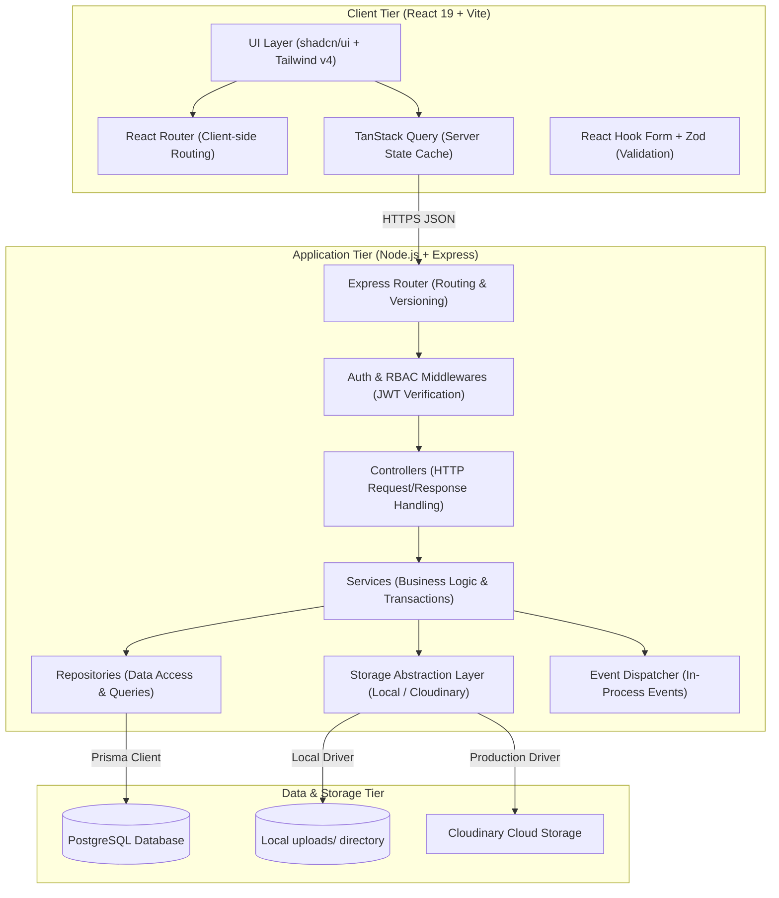

# AssetFlow — Software Architecture Specification

This document details the software architecture, design patterns, security controls, and architectural decisions for the **AssetFlow** platform. It bridges high-level business capabilities with execution-ready patterns.

---

## 1. High-Level Architecture

AssetFlow follows a decoupled Client-Server architecture. The system leverages a **React 19 Frontend** (built with Vite) and a **Node.js/Express.js Backend** interfacing with a **PostgreSQL Database** via the **Prisma ORM**.



---

## 2. Frontend Architecture

The frontend is structured as a client-side Single Page Application (SPA) designed to load fast and operate smoothly on desktop and mobile.

### 2.1 State Management Architecture
We separate state into two distinct lifecycles to avoid excessive global state (Redux/Zustand):
1. **Server State (TanStack Query)**: Handles all asynchronous API caching, background refetching, mutations, optimistic updates, and invalidations. It serves as the primary data cache for lists, details, and KPIs.
2. **UI/Local State (React `useState` / Context)**: Restricted to UI transitions, sidebar toggle states, active tabs, filters configuration, and modal openness.

### 2.2 Routing & Navigation
* **React Router v6**: Manages routes client-side.
* **Route Guards**: Custom wrappers (e.g., `<ProtectedRoute allowedRoles={['ADMIN', 'ASSET_MANAGER']} />`) inspect the session context before rendering features, preventing unauthorized component mount.

### 2.3 Form Governance
* **React Hook Form**: Handles form values, touched states, and submit lifecycles.
* **Zod Schemas**: Shared between frontend and backend. Zod performs schema parsing on submission, triggering inline field-level errors instantly.

---

## 3. Backend Architecture

The backend is built around a layered Express.js application designed to isolate HTTP concerns, business rules, and database queries.

```
┌──────────────────────────────────────────────────────────┐
│                   Express HTTP Router                    │
└────────────────────────────┬─────────────────────────────┘
                             ▼
┌──────────────────────────────────────────────────────────┐
│            Zod Validation & RBAC Middleware              │
└────────────────────────────┬─────────────────────────────┘
                             ▼
┌──────────────────────────────────────────────────────────┐
│                   Feature Controllers                    │
│   - Parses request parameters and HTTP headers           │
│   - Dispatches payload to the Service layer              │
│   - Envelopes JSON response formats                      │
└────────────────────────────┬─────────────────────────────┘
                             ▼
┌──────────────────────────────────────────────────────────┐
│                     Feature Services                     │
│   - Enforces all business invariants & rules             │
│   - Orchestrates transactions across repositories        │
│   - Triggers domain events & storage operations          │
└──────────────┬─────────────────────────────┬─────────────┘
               │                             │
               ▼                             ▼
┌──────────────────────────────┐   ┌───────────────────────┐
│     Feature Repositories     │   │   Storage Abstraction │
│   - Isolates Prisma queries  │   │   - Local upload      │
│   - Maps SQL index errors    │   │   - Cloudinary upload │
└──────────────────────────────┘   └───────────────────────┘
```

---

## 4. Feature-First Architecture

AssetFlow rejects the traditional technical-layer foldering structure (which groups all controllers together, all models together, etc.) in favor of a **Feature-First Architecture**. 

### 4.1 Folder Division
Each folder in the `features/` directory represents a self-contained bounded context. A feature folder owns its UI views, components, Hooks, and services.

```
features/
├── auth/            # Sign-up, login, token refresh, permissions
├── admin/           # Employee roles directory, department hierarchy, category schema builder
├── assets/          # Asset registry, metadata viewer, decommissioning
├── allocation/      # Individual & departmental custody, returns, transfer request workflow
├── booking/         # Shared resource reservation calendar and conflict engine
├── maintenance/     # Ticket dispatch, technician triage kanban board
├── audit/           # Audit cycles, checklists, auditor screens, discrepancies resolving
├── reports/         # KPI summaries, Recharts visualizations, CSV export
└── notifications/   # Unread indicator, alert history feeds
```

### 4.2 Architectural Tradeoffs
* **Layered Folder Structure**:
  * *Pros*: Easy to find all files of a specific type (e.g. all controllers).
  * *Cons*: Heavy "directory hopping" when developing a feature. A change to "Asset Allocation" requires modifying files in 5 distant folders.
* **Feature-First Folder Structure**:
  * *Pros*: High cohesion. Developers work inside a single feature folder. Easy to delete, scale, or merge features. Ideal for split-ownership in a 2-developer hackathon.
  * *Cons*: Shared entities (like database client) need a clear, common home.

---

## 5. Module Responsibilities

| Bounded Context / Module | Frontend Responsibilities | Backend Responsibilities |
|---|---|---|
| **Identity & Access (Auth)** | Sign-in layout, token persistence, context providers, authorization guards. | JWT signing, refresh token rotation, password hashing, active session verification. |
| **Administration (Admin)** | Employee tables, role selectors, Department trees, Category schema builder modals. | Parent department cycle checks, deactivation blocks (employees/departments). |
| **Asset Directory (Assets)** | List directory grid, custom metadata field renderer, decommission modal. | Monotonic sequence tag generation (`AF-XXXX`), validation against category schemas. |
| **Custody & Transfers** | Custody grids, return forms (condition/notes), transfer request wizard. | Double-allocation database locks, transaction custody handover, return updates. |
| **Resource Booking (Booking)**| Scheduler calendar grids, booking request modals, conflict overlay blocks. | Calendar concurrency validation, booking overlaps detection via transactions. |
| **Maintenance** | Kanban status boards, request forms, resolution forms. | Asset state synchronizations, booking cancellations on scheduled maintenance. |
| **Audits & Compliance** | Audit cards, execution checklists (Verify/Missing/Damaged buttons). | Scoped checklist generation, locked cycle blocks, cascading missing status to `LOST`. |
| **Reports & Analytics** | KPI grids, utilization lines, maintenance cost pies, discrepancy inbox. | DB aggregations for KPIs, utilization reports, CSV export streams. |
| **Notifications** | Icon indicator, notification drop-down feed, redirect router. | Real-time payload generation, user Inbox read-status markers. |

---

## 6. Repository Pattern & Service Layer

To guarantee testability and isolate database interactions from routing concerns, we enforce a strict **Service-Repository** pattern.

### 6.1 Coding Standards
1. **Services** contain business logic. They must not access the Express `req` or `res` objects directly. They receive raw parameters, execute validations, coordinate database transactions, and return data transfer objects (DTOs).
2. **Repositories** encapsulate Prisma operations. They receive database structures, run SQL queries, and throw standard exceptions when database integrity fails.

### 6.2 Code Pattern Example (Javascript)
```javascript
// features/assets/asset.repository.js
const { prisma } = require('../../database/client');

class AssetRepository {
  async findById(id) {
    return prisma.asset.findUnique({
      where: { id, deletedAt: null },
      include: { category: true }
    });
  }

  async create(data) {
    return prisma.asset.create({ data });
  }

  async update(id, updateData) {
    return prisma.asset.update({
      where: { id },
      data: updateData
    });
  }
}

module.exports = new AssetRepository();
```

```javascript
// features/assets/asset.service.js
const assetRepository = require('./asset.repository');
const auditCycleRepository = require('../audit/audit.repository');

class AssetService {
  async decommissionAsset(assetId, type, reason, actorId) {
    // 1. Enforce Business Rule (BR-ASSET-03)
    const asset = await assetRepository.findById(assetId);
    if (!asset) throw new Error('ASSET_NOT_FOUND');
    if (asset.status !== 'AVAILABLE') {
      throw new Error('DECOMMISSION_FAILED_STATUS_NOT_AVAILABLE');
    }

    // 2. Enforce Business Rule (BR-AUDIT-05) - Lockout check
    const isLocked = await auditCycleRepository.isAssetLockedInAudit(assetId);
    if (isLocked) {
      throw new Error('ASSET_LOCKED_IN_ACTIVE_AUDIT');
    }

    // 3. Update Asset
    const updated = await assetRepository.update(assetId, {
      status: type, // RETIRED or DISPOSED
      deletedAt: new Date()
    });

    // 4. (Optional) Dispatch Event for downstream bookings cancellation
    // eventBus.emit('AssetDecommissioned', { assetId, actorId });

    return updated;
  }
}

module.exports = new AssetService();
```

---

## 7. Storage Abstraction

To ensure local development runs without external service dependencies, we introduce a storage abstraction layer.

```javascript
// services/storage/storage.service.js
class StorageService {
  async uploadFile(fileBuffer, originalName) {
    throw new Error('Method uploadFile() not implemented.');
  }

  async deleteFile(fileId) {
    throw new Error('Method deleteFile() not implemented.');
  }
}
```

* **Development (LocalFileSystemStorageService)**: Saves uploads directly to the local `/uploads` directory in the workspace root. Returns static URLs mapping the `/static-uploads/` route to the local folder.
* **Production (CloudinaryStorageService)**: Stream uploads to Cloudinary. Returns remote URLs.
* **Factory Resolver**: The application initializes the active driver at startup based on `process.env.NODE_ENV`:
  ```javascript
  const StorageDriver = process.env.NODE_ENV === 'production'
    ? require('./cloudinary-storage.service')
    : require('./local-filesystem-storage.service');
  ```

---

## 8. Authentication Architecture

AssetFlow uses a stateless **JSON Web Token (JWT)** strategy for securing endpoints, combined with database-tracked **Refresh Token Rotations** to manage sessions.

```
Client App                      Express Backend (Auth Module)
   │                                         │
   ├─────────── POST /auth/login ───────────►├─ Verify Password Hashing
   │                                         ├─ Generate JWT Access Token (15 min)
   │                                         ├─ Generate Refresh Token (7 days)
   │                                         ├─ Store Refresh Token in DB
   │◄── Set Cookie (httpOnly, secure) ───────┤
   │◄── Return Access Token (JSON body) ─────┤
   │                                         │
   │── GET /assets (Auth: Bearer access) ───►├─ Verify JWT Signature
   │◄── Return JSON Data ────────────────────┤─ Check roles in RBAC middleware
   │                                         │
   ├─────────── POST /auth/refresh ─────────►├─ Verify cookie Refresh Token
   │                                         ├─ Validate Refresh Token matches DB
   │                                         ├─ Invalidate current Refresh Token
   │                                         ├─ Issue new Access & Refresh Token pair
   │◄── Set Cookie (rotated refresh) ────────┤
   │◄── Return Access Token (JSON body) ─────┤
```

* **Refresh Token Security**: Set as `httpOnly`, `Secure` (in production), and `SameSite=Strict` cookie to eliminate Cross-Site Scripting (XSS) and Cross-Site Request Forgery (CSRF) vulnerabilities.
* **Role/Status Changes Invalidation**: Changes to an employee's role (`EmployeeRoleUpdated` event) or deactivation triggers immediate invalidation of all their refresh token rows in the database, forcing a logout on the next access-token refresh (within 15 minutes).

---

## 9. Authorization Architecture (RBAC)

Role-Based Access Control is enforced through a lightweight declarative middleware.

### 9.1 Role Hierarchy
While roles are distinct, standard route configurations apply clear boundaries:
* `EMPLOYEE`: Access to bookings calendar, raising maintenance tickets, requesting transfers, viewing notifications.
* `DEPT_HEAD`: All employee features, plus approving transfers (of department assets) and booking on behalf of their department.
* `ASSET_MANAGER`: All operational controls. Asset registration, decommissioning, asset allocations, return processing, maintenance approvals, technician dispatch.
* `ADMIN`: Access to settings, role promotions, department hierarchical setup, category schema creation, audit cycles creation, system audit logs.

### 9.2 Express Middleware
```javascript
// middlewares/authorization.middleware.js
function authorizeRoles(...allowedRoles) {
  return (req, res, next) => {
    if (!req.user) {
      return res.status(401).json({
        success: false,
        error: { code: 'UNAUTHORIZED_SESSION', message: 'You must log in to access this resource.' }
      });
    }

    const { role } = req.user;
    if (!allowedRoles.includes(role)) {
      return res.status(403).json({
        success: false,
        error: { code: 'FORBIDDEN_ACTION', message: 'Access denied: Insufficient privileges.' }
      });
    }

    next();
  };
}
```

---

## 10. Event-Driven Notifications

To avoid tight coupling across features, business transitions publish events to an in-process Event Dispatcher.

```
Service Layer Mutation ──► Event Dispatcher ──► Event Handler ──► Database
(e.g., AssetAllocated)                         (Notify Listener)  (Insert Notification)
```

1. **In-Process Events**: Express initialization creates a central Node `EventEmitter` client.
2. **Subscribers**: The notifications module registers listeners for events (e.g., `events.on('AssetAllocated', notifyCustodian)`).
3. **Payload Structure**:
   ```javascript
   {
     employeeId: "target-uuid",
     title: "Asset Custody Allocated",
     message: "You have been allocated custody of MacBook Pro (AF-0014). Due date: 2026-08-12.",
     redirectUrl: "/allocations"
   }
   ```
4. **Processing**: Handlers save notification payloads to the `Notification` database table and optionally broadcast updates (e.g., via simple long-polling or Server-Sent Events if time permits, or simply displaying the new badge on page transitions/polling).

---

## 11. Search Architecture

* **Database Indexes**: Text fields like `assetTag` and `email` have B-Tree indexes.
* **GIN Indexes**: Querying custom parameters inside `Asset.metadata` is optimized using GIN indexes:
  ```sql
  CREATE INDEX "idx_asset_metadata_gin" ON "Asset" USING GIN ("metadata");
  ```
* **Filter Parsing**: Query strings are normalized:
  ```javascript
  const searchFilter = search ? {
    OR: [
      { name: { contains: search, mode: 'insensitive' } },
      { assetTag: { contains: search, mode: 'insensitive' } }
    ]
  } : {};
  ```

---

## 12. Logging Strategy

* **Execution Logs**: Standard Express request/error logs output to console in development, and to raw streams in production.
* **Database Mutation Audit Logs**: Every write operation (`INSERT`, `UPDATE`, `DELETE`) is captured in the database-level `AuditLog` table:
  * Records the `actorId` and `actorEmail` from the token.
  * Records table name and primary record ID.
  * Stores before/after states as JSON payloads.
  * Write-once constraint: Block updates/deletes on `AuditLog` using database constraints.

---

## 13. Error Handling Strategy

All controllers must catch runtime exceptions and route them to Express's global error handler middleware.

```javascript
// middlewares/error.middleware.js
module.exports = (err, req, res, next) => {
  console.error('[System Error Handler]', err);

  const errorResponse = {
    success: false,
    error: {
      code: err.code || 'INTERNAL_SERVER_ERROR',
      message: err.message || 'An unexpected error occurred on the server.'
    }
  };

  // Zod Validation Formatting
  if (err.name === 'ZodError') {
    errorResponse.error.code = 'INVALID_INPUT';
    errorResponse.error.message = 'The data submitted failed schema validations.';
    errorResponse.error.details = err.errors.map(x => ({
      field: x.path.join('.'),
      message: x.message
    }));
    return res.status(400).json(errorResponse);
  }

  // Database Integrity Violations
  if (err.code === 'P2002') { // Prisma Unique Constraint Violation
    errorResponse.error.code = 'RESOURCE_ALREADY_EXISTS';
    errorResponse.error.message = `Conflict: Field ${err.meta.target.join(', ')} already exists.`;
    return res.status(409).json(errorResponse);
  }

  const status = err.statusCode || 500;
  return res.status(status).json(errorResponse);
};
```

---

## 14. Configuration Strategy

We enforce a strict validation wrapper around environmental variables.

```javascript
// config/environment.js
const { z } = require('zod');

const envSchema = z.object({
  PORT: z.string().default('5000'),
  NODE_ENV: z.enum(['development', 'production', 'test']).default('development'),
  DATABASE_URL: z.string().url(),
  JWT_ACCESS_SECRET: z.string().min(32),
  JWT_REFRESH_SECRET: z.string().min(32),
  CLOUDINARY_URL: z.string().optional()
});

const result = envSchema.safeParse(process.env);
if (!result.success) {
  console.error('❌ Environment configuration validation failed:', result.error.format());
  process.exit(1);
}

module.exports = result.data;
```

---

## 15. Security Architecture

1. **SQL Injection Prevention**: Prisma ORM auto-parameterizes queries, blocking injection vectors.
2. **Password Hashing**: BCrypt with a cost factor of 12 for password hashes.
3. **CORS Guards**: Configured whitelist restricted strictly to the frontend host.
4. **Helmet middleware**: Configured headers to prevent frame hijacking, MIME sniffing, and Clickjacking.

---

## 16. Performance Considerations

* **Query Select Restrictions**: Limit database responses. Do not request password hashes or historical audit payloads in listing endpoints.
* **Pagination Constraints**: Cap maximum page limits to 100 entries.
* **N+1 Avoidance**: Use Prisma's `include` filters selectively, and cache static lookup tables (categories, departments) client-side.

---

## 17. Scalability Roadmap

1. **Multi-Tenancy Partitioning**: Future scaling will introduce a `Tenant` entity, with all business tables matching against a tenant ID for row-level query partition.
2. **Depreciation Engine**: Support for depreciation scheduling computations (Straight-Line or Double-Declining-Balance) using background cron schedules.
3. **Out-of-Process Message Queue**: Migration from Node's EventEmitter to Redis/RabbitMQ to dispatch events to dedicated background workers.

---

## 18. Architecture Decision Records (ADRs)

### ADR 01: Client-side UI Built on React 19 & Vite
* **Context**: Odoo Hackathon frontend stack choices.
* **Decision**: React 19 is chosen as the library engine, built via Vite.
* **Alternatives**: Next.js, Vue, Angular.
* **Pros**: Extremely fast rebuild/reload cycles in development, minimal configuration, direct deployment to Vercel, matching modern SPA standards.
* **Cons**: No native server-side rendering (SSR), but unnecessary for an internal enterprise ERP.

### ADR 02: Javascript over Typescript
* **Context**: Choice of programming language for client and server.
* **Decision**: Plain Javascript (ES6+) is enforced.
* **Alternatives**: Typescript.
* **Pros**: Maximizes velocity in an 8-hour hackathon. Avoids compiler/transpiler setups, dependency compatibility loops, or complex generic type-casting boilerplate.
* **Cons**: No compile-time type checking. Mitigated by using strict runtime Zod schemas for forms and controllers.

### ADR 03: Node.js & Express.js Backend
* **Context**: Choice of backend runtime and framework.
* **Decision**: Use Node.js with Express.js.
* **Alternatives**: Fastify, NestJS, Django.
* **Pros**: Simplest configuration, vast package ecosystem, lightweight, rapid development workflow.
* **Cons**: No structural enforcement (can lead to messy code). Mitigated by enforcing a strict feature-first layout.

### ADR 04: Prisma ORM
* **Context**: Database interaction layer.
* **Decision**: Prisma ORM.
* **Alternatives**: Sequelize, TypeORM, raw SQL client.
* **Pros**: Auto-generated type validation wrappers, schema-first migrations, clean declarative relation definitions, out-of-the-box support for PostgreSQL schemas.
* **Cons**: Minor overhead on complex query joins. Mitigated by raw query fallback if needed.

### ADR 05: PostgreSQL Database
* **Context**: Storage database choice.
* **Decision**: PostgreSQL.
* **Alternatives**: MongoDB, MySQL.
* **Pros**: Robust transactional reliability (ACID compliance), excellent support for JSONB (required for category custom fields), partial unique indexing.
* **Cons**: Minor migration overhead compared to schema-less databases.

### ADR 06: Tailwind CSS v4 & shadcn/ui
* **Context**: Styling UI components.
* **Decision**: Tailwind CSS v4 alongside shadcn/ui.
* **Alternatives**: Material UI, Tailwind v3, CSS Modules.
* **Pros**: Rapid prototyping, highly customizable utility classes, accessible keyboard-navigable components, professional and premium dark aesthetics.
* **Cons**: Markup can look cluttered. Mitigated by isolating custom layout logic in shared components.

### ADR 07: JWT & Cookies for Auth Session
* **Context**: Session management.
* **Decision**: Access token in headers, rotated refresh tokens in `httpOnly` secure cookies.
* **Alternatives**: Session ID stored in Redis, basic authentication.
* **Pros**: Stateless API endpoints, high security against token-theft (XSS/CSRF).
* **Cons**: Requires database checks on token refresh.

### ADR 08: Feature-First Architecture
* **Context**: Project code layout.
* **Decision**: Group code by business modules (features) rather than technical layers.
* **Alternatives**: Controller-Service-Repository foldering.
* **Pros**: High modularity, zero merge conflicts, clear feature ownership during split-development.
* **Cons**: Requires standard rules for cross-feature dependencies.
